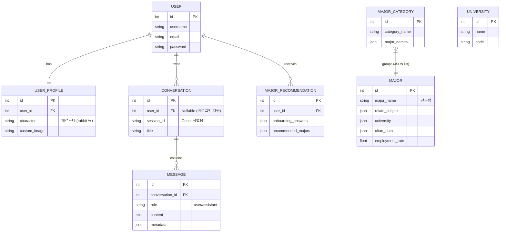

# SK네트웍스 Family AI 캠프 19기 4차 프로젝트

## 1. 팀 소개

### 팀명

**Unigo (유니고)** - University Go, 당신을 위한 대학 입시 가이드

### 멤버

<div align="center">
  <table>
  <tr>
    <td align="center"> 
			     
			 <br/>
      강지완
      <br/>
      <a href="https://github.com/Maroco0109">
        
      </a>
    </td> 
    <td align="center"> 
			       
			<br/>
      김진
      <br/>
      <a href="https://github.com/KIMjjjjjjjj">
        
      </a>
    </td>
    <td align="center"> 
				       
			<br/>
      마한성
      <br/>
      <a href="https://github.com/gitsgetit">
        
      </a>
    </td> 
    <td align="center"> 
			      
			<br/> 
      오하원
      <br/>
      <a href="https://github.com/Hawon-Oh">
        
      </a>
    </td> 
  </tr>
</table>
</div>

---

## 2. 프로젝트 변경 사항

> **"단순 정보 검색에서 개인화된 입시 멘토링 서비스로"**
>
> 이전 3차 프로젝트(공신2)의 한계를 분석하고, 기술적/기능적으로 대폭 개선했습니다.

### 주요 개선 포인트

| 구분            | 3차 프로젝트 (공신2)                    | **4차 프로젝트 (Unigo)**                    | 비고                             |
| :-------------- | :-------------------------------------- | :------------------------------------------ | :------------------------------- |
| **타겟/범위**   | 16개 대학 커리큘럼 중심 (제한적)        | **전국 대학 및 전체 전공 데이터** (확장)    | 입시생 전체로 타겟 확장          |
| **데이터 원천** | 대학별 크롤링 (비정형 데이터)           | **공공 데이터 API & MySQL** (정제된 데이터) | 데이터 신뢰성 및 관리 효율 증대  |
| **핵심 기술**   | **ReAct Agent & LangGraph** (추론형 AI) | **ReAct Agent & LangGraph** (추론형 AI)     | 일부 tool 변경                   |
| **플랫폼**      | Streamlit (프로토타입)                  | **Django Web Application** (상용화 수준)    | 회원가입, 커스텀 UI/UX 구현 가능 |
| **UX 전략**     | 기능 중심 Q&A                           | **페르소나(캐릭터) & 온보딩**               | 사용자 몰입감 및 친밀도 향상     |

### 개선 배경 및 원인

#### 초기 데이터 수집의 한계

- **크롤링 난이도**: 대학마다 상이한 홈페이지 양식과 보안(봇 탐지) 이슈로 인해 안정적인 데이터 수집이 어려움.
- **데이터 파편화**: 학과명이 대학별로 제각각(예: 컴퓨터공학과, SW학부, AI전공...)이라 정규화 및 매핑이 매우 난해함.
- **커리큘럼의 모호성**: 명확한 커리큘럼이 온라인에 공개되지 않은 대학이 많아 일관된 정보 제공 불가.

#### 사용자 경험(UX) 저하

- **제한된 커버리지**: 서울 주요 대학이나 이공계열 위주로 정보가 편중되어, 실제 사용자가 찾는 지방 대학이나 인문/예체능 계열 정보 누락.
- **검색 실패**: 사용자가 원하는 결과가 없음(No Result)으로 나오는 빈도가 높아 서비스 만족도 하락.

<br>

### 데이터 소스 변경 및 전처리 과정

#### 데이터 소스 (Data Sources)

- **major_detail.json(커리어넷)**: 전공 상세 정보 (학과명, 요약, 흥미, 적성, 진출 분야, 관련 직업, 관련 자격증, 주요 교과목, 졸업 후 연봉, 취업률, 입학 경쟁률, 개설 대학 목록 등)
- **university_data_cleaned.json(대학어디가)**: 대학별 정보 및 주소
- **major_categories.json(커리어넷)**: 대분류 학과와 그에 해당하는 학과들 나열

#### 전처리 파이프라인 (Processing Pipeline)

1. **Data Ingestion (데이터 수집 및 로드)**
   - 커리어넷 등에서 수집된 대용량 JSON 파일 로드 및 원본 데이터의 복잡한 중첩 구조(`dataSearch > content`) 파싱
2. **Dual-Store Strategy (이원화 저장 전략)**
   - **MySQL (Structured Data)**: 전공명, 취업률, 연봉 등 정형 데이터를 RDBMS 테이블 스키마에 맞춰 매핑 및 적재
   - **Pinecone (Vector Data)**: 자연어 검색을 위해 전공 개요, 흥미, 적성 등 텍스트 데이터를 `MajorDoc` 문서 객체로 변환하여 임베딩 및 인덱싱
3. **Optimization (인덱싱 최적화)**
   - 데이터 특성에 따라 3가지 네임스페이스(`majors`, `major_categories`, `university_majors`)로 분리하여 벡터화 수행

### 인프라 전환: Vector DB (Migration)

> **Chroma DB (Local)** ➡️ **Pinecone (Serverless Cloud)**

#### 전환 이유

1.  **운영 복잡도 해소**: 로컬 DB 관리(Docker Volume, 파일 손상 등)의 부담을 덜고 완전 관리형(SaaS) 서비스 도입.
2.  **Serverless 효율**: 트래픽이 없을 땐 비용이 0에 수렴하며, 필요시 즉각 스케일링되는 유연한 구조.

#### 도입 효과

- **Stateless 아키텍처**: 백엔드 컨테이너를 언제든 껐다 켜도 데이터 동기화 문제 없음 (Docker Compose 구성 단순화).
- **개발 편의성**: 팀원 간 로컬 환경(OS, 디스크 경로 등) 차이 없이 동일한 API 키로 동일한 검색 결과 보장.


#### 주요 기대 효과

1.  **데이터 커버리지 100%**: 국내 존재하는 모든 대학 및 학과 정보 탑재.
2.  **정교한 검색 경험**:
    - **정확한 학과 검색**: "연세대학교에 컴퓨터 공학과가 있어?" → "연세대학교에는 "컴퓨터공학과"라는 명칭의 학과는 없지만, "인공지능학과"와 "첨단컴퓨팅학부"가 개설되어 있습니다. 이 두 학과는 컴퓨터 관련 분야와 밀접한 연관이 있습니다."
3.  **One-Stop 입시 정보**: 단순 학과 소개를 넘어, 해당 학과가 개설된 대학 리스트와 입시처 링크까지 연결.

#### 핵심 기능 (Tools) 구현

| 기능(Tool)                       | 설명                             | 기술 스택                         |
| :------------------------------- | :------------------------------- | :-------------------------------- |
| `list_departments`               | 키워드/카테고리 기반 학과 추천   | **Pinecone** (Vector) + **MySQL** |
| `get_universities_by_department` | 특정 전공 개설 대학 및 학과 매칭 | **Pinecone** + **MySQL**          |
| `get_major_career_info`          | 진로, 연봉, 취업률 등 상세 정보  | **MySQL** (CareerNet Data)        |
| `get_university_admission_info`  | 대학별 입시 요강 페이지 연결     | **MySQL** (Adiga Data)            |

<br>


---

## 3. 프로젝트 개요

### 프로젝트 명

**Unigo (AI 기반 대학 전공 추천 및 입시 상담 챗봇)**

### 프로젝트 소개

LLM(Large Language Model)과 RAG(Retrieval Augmented Generation) 기술을 활용하여 수험생과 진로를 고민하는 학생들에게 **개인 맞춤형 전공 추천**과 **정확한 입시 정보**를 제공하는 대화형 AI 서비스입니다.

### 프로젝트 필요성 (배경)

- **정보의 비대칭성**: 대학 입시 정보는 **방대하고 파편화**되어 있어 학생들이 자신에게 맞는 정보를 찾기 어렵습니다.
- **맞춤형 상담의 부재**: 기존의 커리어넷/워크넷 등은 정적인 정보만 제공하며, **개인의 성향을 고려한 심층적인 대화형 상담이 부족합니다**.
- **비용 문제**: 사설 입시 컨설팅은 **고비용**으로 접근성이 낮습니다. 누구나 쉽게 접근 가능한 AI 멘토가 필요합니다.

### 프로젝트 목표

1. **정확성**: Pinecone 벡터 DB와 RAG를 통해 Hallucination을 최소화한 신뢰성 있는 정보 제공
2. **개인화**: LangGraph 기반의 ReAct 에이전트를 통해 사용자의 의도를 파악하고 다단계 추론을 통한 맞춤 답변 제공
3. **편의성**: 직관적인 채팅 인터페이스와 사용자 친화적인 온보딩 프로세스 구축

---

## 4. 프로젝트 구조

```
Unigo/
├── backend/                             # AI 백엔드 (LangGraph + RAG)
│   ├── data/                            # 초기 데이터 (Seeding)
│   │   ├── major_detail.json            # 학과 상세 정보 (커리어넷)
│   │   ├── major_categories.json        # 학과 대분류 데이터
│   │   └── university_data_cleaned.json # 대학 기본 정보 (대학어디가)
│   ├── db/                              # DB 관리 (SQLAlchemy)
│   │   ├── connection.py                # DB 연결 설정
│   │   ├── models.py                    # DB 테이블 모델 (Major, University 등)
│   │   ├── seed_all.py                  # 전체 데이터 시딩 실행
│   │   └── seed_*.py                    # 개별 테이블 시딩 스크립트
│   ├── graph/                           # LangGraph 워크플로우
│   │   ├── graph_builder.py             # 그래프 구조 및 엣지 연결
│   │   ├── nodes.py                     # 노드별 로직 (Agent, Tools)
│   │   ├── state.py                     # 그래프 상태(State) 정의
│   │   └── helper.py                    # 그래프 유틸리티
│   ├── rag/                             # RAG 시스템
│   │   ├── tools.py                     # LangChain 도구 (검색, 조회)
│   │   ├── retriever.py                 # Pinecone 검색 로직
│   │   ├── embeddings.py                # 임베딩 생성 (OpenAI)
│   │   ├── vectorstore.py               # Pinecone 클라이언트 및 인덱싱
│   │   ├── loader.py                    # JSON 데이터 로딩 및 파싱
│   │   └── build_major_index.py         # 벡터 인덱스 생성 스크립트
│   ├── scripts/                         # 추가 유틸리티
│   │   └── ingest_*.py                  # 데이터 인덱싱 스크립트
│   ├── config.py                        # 환경 변수 및 설정 로드
│   └── main.py                          # AI 서버 엔트리포인트
│
├── unigo/                               # Django 웹 애플리케이션
│   ├── unigo_app/                       # 메인 앱
│   │   ├── views.py                     # API 및 뷰 로직 (채팅, 인증)
│   │   ├── models.py                    # Django 모델 (Conversation, Message)
│   │   ├── urls.py                      # URL 라우팅
│   │   └── admin.py                     # 관리자 페이지 설정
│   ├── unigo/                           # 프로젝트 설정
│   │   ├── settings.py                  # Django 전역 설정
│   │   ├── urls.py                      # 루트 URL 설정
│   │   └── asgi.py/wsgi.py              # 서버 인터페이스
│   ├── templates/                       # HTML 템플릿 파일
│   │   └── unigo_app/
│   │       ├── base.html                # 기본 레이아웃 (헤더, 푸터 포함)
│   │       ├── auth.html                # 로그인/회원가입 페이지
│   │       ├── chat.html                # 메인 채팅 인터페이스
│   │       ├── character_select.html    # 캐릭터 선택 (온보딩)
│   │       └── setting.html             # 사용자 설정 페이지
│   ├── static/                          # 정적 자산
│   │   ├── css/                         # 스타일시트
│   │   │   ├── chat.css                 # 채팅 화면 스타일
│   │   │   ├── setting.css              # 설정 페이지 스타일
│   │   │   └── styles.css               # 공통 스타일
│   │   ├── js/                          # 클라이언트 스크립트
│   │   │   ├── chat.js                  # 채팅 로직 및 웹소켓 처리
│   │   │   ├── setting.js               # 설정 변경 핸들링
│   │   │   └── character_select.js      # 온보딩 인터랙션
│   │   └── images/                      # 이미지 자산 (캐릭터, 아이콘)
│   ├── media/                           # 사용자 업로드 파일
│   └── manage.py                        # Django 관리 명령
│
├── nginx/                               # Nginx 설정 파일
├── docs/                                # 개발 문서 및 회고록
├── docker-compose.yml                   # Docker 컨테이너 오케스트레이션
├── Dockerfile                           # Docker 이미지 빌드 설정
├── .env                                 # 환경 변수 (API Key, DB 접속 정보)
└── requirements.txt                     # Python 패키지 의존성 목록
```

---

## 5. 요구사항 명세서


https://www.notion.so/2c40413479c480458e42ebb6e116eef1

---

## 6. 화면 정의서


https://www.figma.com/design/EQooVBPUshPncXDORTfJhB/%EC%9C%A0%EB%8B%88%EA%B3%A0?node-id=0-1&p=f&t=aAT9BriN4yCgShcK-0

---

## 7. WBS


https://www.notion.so/1-Unigo-28b0413479c481999c87d8546598ca95

---

## 8. 주요 기능

### 1) 🤖 RAG 기반 AI 멘토

**ReAct(Reasoning + Acting) 패턴**을 적용한 AI 에이전트가 사용자의 질문을 분석하고 필요한 정보를 실시간으로 검색하여 답변합니다.

- **전공 탐색**: "인공지능 배우려면 무슨 과 가야 해?" -> 관련 학과 및 커리큘럼 소개
- **대학 검색**: "컴퓨터공학과 있는 서울 대학 어디야?" -> 개설 대학 목록 및 위치 정보 제공
- **진로 상담**: "기계공학과 나오면 취업 잘 돼?" -> 취업률, 평균 연봉, 주요 진출 분야(커리어넷 데이터 기준) 제공
- **입시 정보**: 각 대학 입학처의 수시/정시 모집요강 바로가기 링크 제공

### 2) 🎓 맞춤형 전공 추천 (온보딩)

사용자와의 초기 인터뷰(7가지 질문)를 통해 성향을 분석하고 최적의 전공을 추천합니다.

- **분석 요소**: 선호 과목, 관심사, 활동 유형, 선호 환경, 가치관, 관심 주제, 학습 스타일
- **알고리즘**: 사용자 프로필 벡터와 전공 특성 벡터 간의 다차원 유사도 분석 + 가중치 적용 점수 시스템

### 3) 🔑 사용자 경험 (UX)

- **회원가입/로그인**: 개인화된 대화 기록 및 추천 결과 저장
- **채팅 히스토리**: 이전 상담 내용을 언제든지 다시 확인 가능
- **마크다운 지원**: 가독성 높은 텍스트 및 클릭 가능한 링크 제공
- **페르소나 캐릭터**: 친근한 캐릭터(토끼 등) 기반 인터페이스

---

## 9. 기술 스택

| 분류          | 기술                        | 비고                                                |
| ------------- | --------------------------- | --------------------------------------------------- |
| **Backend**   | Python 3.11+, Django 5.x    | 웹 프레임워크 및 API                                |
| **Data**      | MySQL                       | 관계형 데이터베이스 (전공/대학 정보, 사용자 데이터) |
| **AI / RAG**  | LangChain, LangGraph        | AI 에이전트 및 워크플로우 관리                      |
| **LLM**       | OpenAI GPT-4o-mini          | 추론 및 자연어 생성                                 |
| **Vector DB** | Pinecone                    | 고성능 벡터 검색                                    |
| **Frontend**  | HTML5, CSS3, JS, Django 5.x | 반응형 웹 인터페이스                                |

---

## 10. 시스템 아키텍처 & 기술적 전략 (System Architecture & Technical Strategy)

### 1) 시스템 개요 (System Overview)

이 시스템은 Nginx 리버스 프록시 뒤에서 Django가 웹 애플리케이션과 AI 백엔드 로직을 모두 처리하는 **모듈러 모놀리스(Modular Monolith)** 아키텍처를 따릅니다.


### 2) 아키텍처 분석: Hybrid Approach (Django + SQLAlchemy)

이 프로젝트는 일반적인 웹 애플리케이션 프레임워크인 **Django**와 파이썬 데이터 생태계의 표준 ORM인 **SQLAlchemy**를 동시에 사용하는 하이브리드 구조를 채택하고 있습니다.

- **Django**: 웹 서비스의 '뼈대'를 담당
  - **역할**: 사용자 인증(Auth), 관리자 페이지(Admin), 정적 파일 관리, 엔드포인트 라우팅(Views).
  - **특징**: 생산성이 높고 보안 기능이 내장되어 있어 웹 서비스 구축에 효율적입니다.
- **SQLAlchemy**: AI/데이터 서비스의 '심장'을 담당
  - **역할**: RAG(검색 증강 생성)를 위한 벡터 메타데이터 관리, 대용량 데이터(전공, 대학 정보) 적재 및 조회, LangChain 등 AI 라이브러리와의 연동.
  - **위치**: `backend/db`, `backend/rag`, `backend/main.py` 등 AI 로직이 집중된 모듈에서 주로 사용됨.

### 3) SQLAlchemy를 사용이유

단순히 Django ORM만으로도 데이터베이스 조작이 가능함에도 불구하고, SQLAlchemy를 별도로 도입한 데에는 다음과 같은 강력한 기술적 이유가 존재합니다.

1.  **AI/Data 생태계와의 호환성 (Ecosystem Compatibility)**

    - LangChain 및 대부분의 최신 AI 라이브러리(LlamaIndex 등)는 RAG 파이프라인 구축 시 **SQLAlchemy를 사실상의 표준(De-facto Standard)**으로 지원합니다.
    - Django ORM은 프레임워크에 강하게 결합되어 있어 독립적인 AI 모듈에서 사용하기 무겁고 설정이 복잡한 반면, SQLAlchemy는 가볍고 독립적으로 동작하여 AI 모듈과의 결합이 자연스럽습니다.

2.  **성능 및 미세 제어 (Performance & Fine-grained Control)**

    - **Bulk Operation**: `seed_all.py` 등 대용량 데이터 적재 시, SQLAlchemy Core를 사용하여 Raw SQL 수준의 성능을 내면서도 파이썬 객체로 관리할 수 있습니다.
    - **Connection Pooling**: AI 모델 서빙과 같이 리소스 관리가 중요한 환경에서 `pool_pre_ping=True`, `pool_recycle=3600` 등 상세한 커넥션 풀 설정을 통해 DB 연결 안정성을 확보했습니다.

3.  **복잡한 데이터 타입 처리**: `Major` 모델의 `LONGTEXT` 컬럼에 JSON 데이터를 저장하는 등 비정규화된 패턴이나 커스텀 타입을 매핑할 때 훨씬 유연한 기능을 제공합니다.

### 4) 상세 분석: Django와 SQLAlchemy의 공존 (Co-existence Strategy)

시스템은 **"Django가 문지기(Gatekeeper) 역할을 하고, SQLAlchemy가 두뇌(Brain) 역할을 하는 구조"**입니다.

1.  **진입 (Entry)**: 사용자 프론트엔드가 Django 웹 서버(`unigo_app/views.py`)로 HTTP 요청을 보냅니다.
2.  **보안 및 인증 (Security)**: Django가 세션 인증, 권한 검사 등을 수행합니다. (Django ORM 사용)
3.  **위임 (Delegation)**: 유효한 요청이라면 Django View가 `backend.main.run_mentor()`를 호출하여 제어권을 AI 로직으로 넘깁니다.
4.  **AI 추론 (Inference)**: `run_mentor`는 LangGraph를 실행하며, 이 과정에서 필요한 데이터 조회는 SQLAlchemy를 통해 `Major`/`University` 테이블 및 Vector Store에 접근합니다.
5.  **응답 (Response)**: AI가 생성한 최종 답변 텍스트만 Django View로 반환되어 클라이언트에게 전달됩니다.

### 5) AI 도구 & 워크플로우 (AI Tools & Workflow)

AI 멘토는 **LangGraph**를 사용하여 상태 기반의 워크플로우를 관리하며, `backend/rag/tools.py`에 정의된 도구들을 사용하여 답변을 생성합니다.


### 6) 데이터베이스 클러스터 & 스키마 (Database Clusters & Schema)

데이터베이스는 크게 **세 가지 논리적 영역(Cluster)**으로 나뉘어 관리되고 있습니다.

1.  **User & Chat Cluster (Django)**: 사용자, 대화 기록, 프로필 관리 (웹 서비스 영역)
2.  **AI Data Cluster (SQLAlchemy)**: RAG/검색 엔진이 사용하는 전공 및 대학 원본 데이터 (AI 영역 - 핵심 데이터)
3.  **App Data Cluster (Django)**: Django Admin용으로 정의되었으나 AI 로직과는 분리된 영역

**주요 테이블 관계도**

| 모델명 (Model)          | 관리 주체  | 설명 (Description)           | 주요 필드                                                                          |
| :---------------------- | :--------- | :--------------------------- | :--------------------------------------------------------------------------------- |
| **MajorCategory**       | SQLAlchemy | 전공 상세 정보 (커리어넷)    | `id`, `category_name`, `subject_name`                                              |
| **Major**               | SQLAlchemy | 전공 상세 정보 (커리어넷)    | `id`, `major_name`, `relate_subject`, `university`, `chat_data`, `employment_rate` |
| **University**          | SQLAlchemy | 대학 메타데이터 (대학어디가) | `id`, `name`, `code`                                                               |
| **MajorRecommendation** | SQLAlchemy | 전공-대학 매핑 (Mapping)     | `id`, `user_id`, `onboarding_answers`, `recommended_majors`                        |
| **Conversation**        | Django     | 채팅 세션 정보               | `id`, `user_id`, `session_id`, `title`                                             |
| **Message**             | Django     | 채팅 메시지 내역             | `id`, `conversation_id`, `role`, `content`, `metadata`                             |
| **UserProfile**         | Django     | 사용자 프로필 정보           | `id`, `user_id`, `character`, `custom_image`                                       |

> **주의사항**: 두 개의 ORM이 하나의 DB를 공유하므로, 마이그레이션 시 주의가 필요합니다. `User/Chat` 영역은 Django `migrate`로, `AI Data` 영역은 `init_db.py` 등 별도 스크립트로 관리하여 두 영역의 충돌을 방지합니다.

#### 벡터 데이터베이스 (Pinecone)

- **`major_categories`**: 광범위한 매칭을 위한 표준 전공명 및 카테고리 임베딩.
- **`university_majors`**: 세밀한 의미 기반 검색을 위한 "대학명 + 학과명" 쌍의 임베딩.

#### ERD



---

## 11. 배포 과정 (Deployment)

### 배포 환경

- **Cloud Platform**: AWS EC2 / Azure VM
- **Web Server**: Nginx (Reverse Proxy)
- **WAS**: Gunicorn
- **Database**: MySQL, Pinecone (Serverless)

### 배포 파이프라인

1. **Source Control**: GitHub를 통한 코드 형상 관리
2. **Build**: `requirements.txt` 의존성 설치 및 정적 파일(`collectstatic`) 빌드
3. **Run**: Gunicorn을 사용하여 Django 애플리케이션 실행, Nginx가 80포트로 들어오는 요청을 Gunicorn 소켓으로 포워딩

---

## 12. 트러블 슈팅 (Troubleshooting)


https://www.notion.so/2cb0413479c4800aae5ae66665d29c51

---

## 13. 테스트 계획 및 결과


| [Notion](https://www.notion.so/2cc0413479c480fab4b0f122297a40ea)

---

## 14. 수행결과 (시연)

### 1) 로그인 및 회원가입

- 이메일/닉네임 중복 체크 및 보안 로그인

### 2) 온보딩 (성향 분석)

- **시나리오**: '추천 시작' 키워드로 시작 -> 7가지 성향 질문 응답 -> 가중치 기반 Top 5 학과 추천
- **결과**: 사용자의 관심사(예: "분석하는 일, 수학, 헬스")를 반영한 학과 추천 제공

### 3) 메인 채팅 & Tool Calling

- **시나리오 1 (학과 검색)**: "인공지능 관련된 학과들 다 알려줘" -> `list_departments` 호출
- **시나리오 2 (대학 검색)**: "연세대 컴퓨터 공학과 있어?" -> `get_universities_by_department` 호출
- **시나리오 3 (진로 정보)**: "컴퓨터공학과 졸업하면 연봉 어때?" -> `get_major_career_info` 호출
- **시나리오 4 (입시 정보)**: "서울대학교 입시 정보 알려줘." -> `get_university_admission_info` 호출
- **시나리오 5 (검색 도움)**: "사용법좀 알려줘." (잡담/검색 실패) -> `get_search_help` 호출

### 4) 설정 및 개인화

- 캐릭터 선택(토끼, 거북이 등) 및 커스텀 이미지 업로드
- "내 관심사 기억해?" -> 저장된 온보딩 정보 기반 답변 확인

---

## 15. 한 줄 회고

- **강지완**: "지난 3차 프로젝트의 한계점이 명확해서 이에 대한 개선점에 집중한 프로젝트였습니다. 특히, 데이터 관련 한계가 있습니다. 단순 크롤링 스니펫만을 활용하여 데이터를 수집하는 과정은 자동화도 힘들고 현재 존재하는 모든 대학에 대한 정보를 얻는것이 거의 불가능하다고 생각했습니다. 커리어넷 API, Adiga 입시 정보 사이트를 활용하여 파편화된 대학 관련 정보를 하나의 도메인으로 통합하는 것을 목표로 잡았습니다. 결과적으로 의도한 100%의 목표를 이루었다고는 할 수 없지만, 어느정도 괜찮은 정보를 제공할 수 있게 되었습니다. Docker, AWS를 활용한 배포가 처음이었는데 배포 하는 과정에서 linux 서버에 대한 이해도를 높일 수 있었습니다."
- **김진**: "이번 프로젝트를 진행하며 단순한 정보 나열이 아닌 사용자의 질문 의도와 흐름을 고려한 응답 구조의 중요성을 느꼈다. 커리어넷 및 전국 대학 학과 데이터를 새로 수집하여 전체 학과 정보를 제공함으로써 정보 제공의 신뢰도를 높였다. 또한 툴 호출 결과를 프롬프트로 재구성하고 요약 기능을 적용함으로써 정보 과다로 인한 혼란을 줄이고 사용자 중심의 대화 경험을 구현했다. 이 과정을 통해 기술 구현뿐만 아니라 사용자 경험을 중심으로 사고하려는 태도를 기를 수 있었다."
- **마한성**: "데이터 정형화의 어려움을 겪으며 '신뢰할 수 있는 데이터 파이프라인'의 중요성을 체감했습니다. 이를 해결하는 과정에서 백엔드를 넘어 프론트엔드(HTML/JS)까지 직접 구현하고, 팀 전체의 아키텍처를 분석하며 서비스의 전체 구조를 다루는 경험을 했습니다."
- **오하원**: "3차에서 안 됐거나 피드백 받은 부분들, 프론트를 react로 다 만들었으나 다시 django로 새로 만들었던 점, 3차 때 크롤링했던 모든 데이터들을 새로운 오픈데이터셋(API)으로 바뀐 점, 원래는 고려하지 않았지만 프로젝트 진행하며 새롭게 추가시킨 점 등, 많은 내용들이 오고갔음에도 팀원 모두 프로젝트 진행상황을 인지하며 협업했던 점에서 좋은 경험을 쌓았다 생각합니다."
