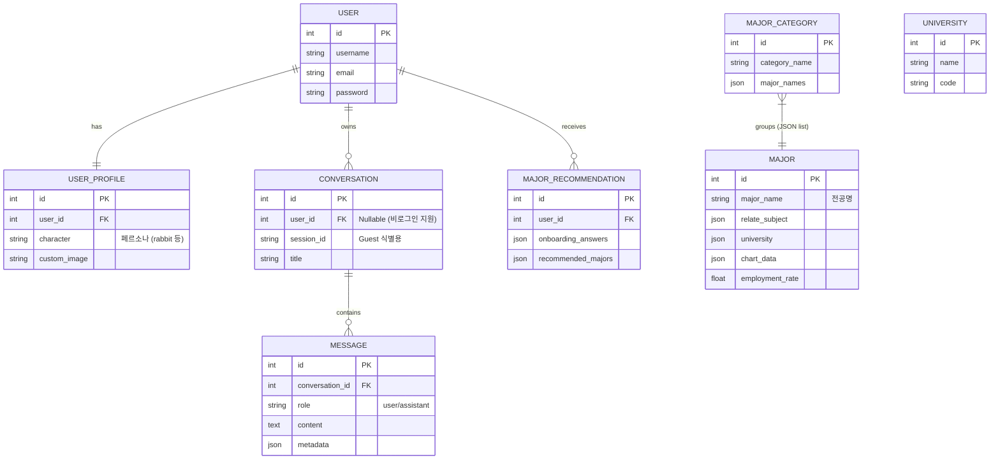

# 프로젝트 리뷰 보고서

**날짜**: 2025-12-16  
**작성자**: Antigravity (AI Agent)  
**참고**: `.agent/workflows/plan.md`, `.agent/workflows/workflow.md`

---

## 1. 개요

본 보고서는 현재 프로젝트(`Unigo`)의 코드베이스를 분석하여 아키텍처의 특징을 진단하고, 특히 **Django ORM과 SQLAlchemy가 혼용되는 이유**에 대한 기술적 타당성을 검토하기 위해 작성되었습니다.

## 2. 아키텍처 분석: Hybrid Approach (Django + SQLAlchemy)

이 프로젝트는 일반적인 웹 애플리케이션 프레임워크인 **Django**와 파이썬 데이터 생태계의 표준 ORM인 **SQLAlchemy**를 동시에 사용하는 **하이브리드 구조**를 채택하고 있습니다.

### 2.1 구성 요소별 역할

- **Django**: 웹 서비스의 '뼈대'를 담당.
  - 역할: 사용자 인증(Auth), 관리자 페이지(Admin), 정적 파일 관리, 엔드포인트 라우팅(Views).
  - 특징: 생산성이 높고 보안 기능이 내장되어 있어 웹 서비스 구축에 효율적입니다.
- **SQLAlchemy**: AI/데이터 서비스의 '심장'을 담당.
  - 역할: RAG(검색 증강 생성)를 위한 벡터 메타데이터 관리, 대용량 데이터(전공, 대학 정보) 적재 및 조회, LangChain 등 AI 라이브러리와의 연동.
  - 위치: `backend/db`, `backend/rag`, `backend/main.py` 등 AI 로직이 집중된 모듈에서 주로 사용됨.

---

## 3. 핵심 질문: 왜 굳이 SQLAlchemy를 사용해야 했는가?

단순히 Django ORM만으로도 데이터베이스 조작이 가능함에도 불구하고, SQLAlchemy를 별도로 도입한 데에는 다음과 같은 강력한 기술적/과학적 이유가 존재합니다.

### 3.1 AI/Data 생태계와의 호환성 (Ecosystem Compatibility)

- **LangChain & Vector Stores**: 프로젝트의 핵심인 RAG 파이프라인(`backend/rag`)은 `LangChain` 프레임워크를 기반으로 합니다. LangChain 및 대부분의 최신 AI 라이브러리(LlamaIndex 등)는 데이터베이스 연동 시 **SQLAlchemy를 사실상의 표준(De-facto Standard)**으로 지원합니다.
- Django ORM은 Django 프레임워크에 강하게 결합되어 있어, 독립적인 스크립트나 AI 파이프라인에서 단독으로 사용하기에는 설정이 복잡하고 무겁습니다. 반면 SQLAlchemy는 가볍고 독립적으로 동작하여 AI 모듈과의 결합이 훨씬 자연스럽습니다.

### 3.2 성능 및 미세 제어 (Performance & Fine-grained Control)

- **Bulk Operation**: `seed_all.py` 등 데이터 적재 스크립트를 분석한 결과, 대학/전공 등 방대한 정형 데이터를 다룹니다. SQLAlchemy Core는 ORM 레이어를 우회하여 Raw SQL 수준의 성능을 내면서도 파이썬 객체로 관리할 수 있어 대량 데이터 처리에 유리합니다.
- **Connection Pooling**: `backend/db/connection.py`를 보면 `pool_pre_ping=True`, `pool_recycle=3600` 등 상세한 커넥션 풀 설정이 되어 있습니다. 이는 AI 모델 서빙과 같이 장시간 실행되거나 리소스 관리가 중요한 환경에서 DB 연결 안정성을 확보하기 위함입니다.

### 3.3 아키텍처의 유연성 (Architecture Decoupling)

- 프로젝트는 웹(Django)과 AI(Logic)가 분리되어 있는 구조입니다. 향후 AI 기능이 고도화되어 별도의 **Microservice(예: FastAPI 서버)**로 분리될 가능성이 높습니다.
- 지금부터 AI 로직을 SQLAlchemy로 작성해 두면, 나중에 Django 의존성을 걷어내고 해당 모듈만 떼어내어 독립 서버로 이전하기가 매우 수월해집니다. Django ORM을 썼다면 코드를 전면 재작성해야 했을 것입니다.

### 3.4 복잡한 데이터 타입 처리

- `Major` 모델(`backend/db/models.py`)을 보면 `LONGTEXT` 컬럼에 JSON 데이터를 저장하는 비정규화된 패턴이 보입니다.
- SQLAlchemy는 이러한 커스텀 타입이나 레거시 데이터 스키마에 매핑할 때 Django ORM보다 훨씬 유연한 매핑 기능을 제공합니다.

---

## 5. 상세 분석: Django와 SQLAlchemy의 공존 (Co-existence Strategy)

사용자 요청 흐름을 추적하여 두 기술이 어떻게 협력하는지 구체적으로 분석했습니다.

### 5.1 요청 처리 데이터 파이프라인

시스템은 **"Django가 문지기(Gatekeeper) 역할을 하고, SQLAlchemy가 두뇌(Brain) 역할을 하는 구조"**입니다.

1. **진입 (Entry)**: 사용자 프론트엔드(Streamlit 등)가 Django 웹 서버(`unigo/unigo_app/views.py`)로 HTTP 요청을 보냅니다.
2. **보안 및 인증 (Security)**: Django가 미들웨어를 통해 세션 인증, 권한 검사, 요청 유효성 검증을 수행합니다. 이 단계까지는 Django ORM(User 테이블 등)만 사용됩니다.
3. **위임 (Delegation)**: 유효한 요청이라면 Django View가 `backend.main.run_mentor()` 함수를 호출하여 제어권을 AI 로직으로 넘깁니다.
4. **AI 추론 (Inference)**:
   - `run_mentor`는 LangGraph를 실행합니다.
   - 이 과정에서 방대한 전공 데이터(`Major` 테이블)나 대학 정보(`University` 테이블) 조회가 필요하면 **SQLAlchemy**를 통해 고속으로 데이터를 가져옵니다.
   - 벡터 검색(RAG)이 필요한 경우에도 SQLAlchemy 기반의 Vector Store와 상호작용합니다.
5. **응답 (Response)**: AI가 생성한 최종 답변 텍스트만 Django View로 반환되고, Django는 이를 JSON으로 포장하여 클라이언트에게 응답합니다.

### 5.2 왜 이렇게 나누었는가? (Architecture Style: Modular Monolith)

이러한 패턴은 **모듈러 모놀리스(Modular Monolith)**의 전형적인 형태입니다.

- 우리는 하나의 서버(Monolith) 안에 있지만, **웹 계층(Django)**과 **도메인 계층(Backend/AI)**을 철저히 분리했습니다.
- 만약 처음부터 Django 모델로 전공/대학 데이터를 만들었다면, AI 로직이 Django 객체(`QuerySet`)에 강하게 종속되어 나중에 독립적인 AI 서버로 떼어내기(Microservice 전환)가 매우 어려웠을 것입니다.
- 현재 구조는 **결합도(Coupling)를 낮춘** 훌륭한 설계입니다.

---

## 6. 전체 데이터베이스 ERD (Full Database Schema)

프로젝트 분석 결과, 데이터베이스는 크게 **세 가지 논리적 영역(Cluster)**으로 나뉘어 관리되고 있습니다.

1. **User & Chat Cluster (Django)**: 사용자, 대화 기록, 프로필 관리 (웹 서비스 영역)
2. **AI Data Cluster (SQLAlchemy)**: RAG/검색 엔진이 사용하는 전공 및 대학 원본 데이터 (AI 영역 - **현재 핵심 데이터**)
3. **App Data Cluster (Django - Inactive/Future)**: Django Admin용으로 정의된 것으로 보이나, 현재 AI 로직(`seed_all.py` 등)과는 분리된 전공/대학 테이블

아래는 이 모든 테이블의 관계도입니다.

### ERD 상세 분석

- **물리적 분리**: `MAJOR`(SQLAlchemy)와 `APP_MAJOR`(Django)는 이름이 비슷하지만 **완전히 다른 테이블**(`majors` vs `unigo_app_major`)입니다.
- **현재 상태**: `seed_all.py` 등 핵심 스크립트는 `MAJOR`(`majors`) 테이블에 데이터를 넣고 있습니다. `APP_MAJOR` 테이블들은 사용되지 않거나 비어있을 가능성이 높습니다.
- **관리 포인트**: 마이그레이션 시 이 두 영역이 섞이지 않도록 주의해야 합니다. Django `migrate` 명령은 1/3번 클러스터를 건드리고, `init_db.py`는 2번 클러스터를 건드립니다.

---

## 7. 결론

현재의 **Django(Web) + SQLAlchemy(AI)** 구조는 단순한 중복이 아니라, **각 기술의 장점을 극대화한 합리적인 선택**으로 판단됩니다.

- **웹 개발의 편의성**은 Django가 보장합니다.
- **AI 개발의 성능과 호환성**은 SQLAlchemy가 보장합니다.

**주의사항**: 두 개의 ORM이 하나의 DB를 공유하므로, **마이그레이션 관리**에 주의해야 합니다. 앞서 사용자가 질문했던 `init_db`(SQLAlchemy용)와 `migrate`(Django용)가 분리된 이유도 바로 이 두 세계를 명확히 구분하여 관리하기 위함입니다. 이 규칙을 철저히 지키는 것이 시스템 안정성의 핵심입니다.
